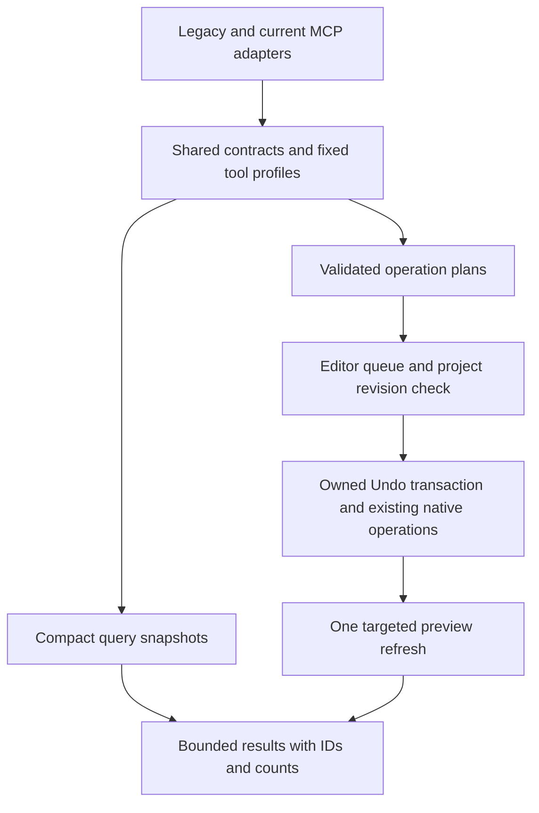

# MCP efficiency and architecture review

Review date: 2026-09-03. Repository: `ItsJosshy/blockbench-mcp-plugin`, `main` at `056eca5e120d48064302d881e0f016001927e97f`. Package version: **1.1.0**.

Historical baseline audit. See the [1.2.0 implementation and verification report](efficiency-implementation.md)
for completed changes, current measurements and remaining work.

**Recommendation: retain the in-process TypeScript plugin and its native operation implementations, then incrementally redesign discovery, results and transaction orchestration. Do not rebuild the whole server.** Ordinary local calls are already fast. The strongest measured opportunities are resource payloads, quadratic discovery and batching. A separate protocol adapter migration is justified by upstream MCP changes, independently of these performance fixes.

This is an audit and implementation plan, not a claim that the optimizations below have shipped. The accompanying [complete inventory](efficiency-inventory.md) evaluates **all 106 tools, 16 resource definitions and 6 registered prompts**, plus all 11 bundled prompt fragments. [Measurements](efficiency-measurements.json) contain sanitized timings, counts and preservation results. No model content or project identifiers are included there.

## Evidence and scope

Read the repository instructions, README, CONTRIBUTING, VERSIONING, latest CHANGELOG, CLAUDE and agent installation guidance; reviewed existing bug/experimental/roundtrip reports as historical evidence. Inspected every registered tool implementation, schemas and registration, resources, prompts, shared native helpers, transport/session/factory code, settings, build and documentation paths. Existing historical verification versions remain unchanged.

The live endpoint was `http://127.0.0.1:3000/bb-mcp`, using the currently connected **Blockbench 5.1.6 / MCP plugin 1.1.0**. The plugin reported a URL installation from the repository's nightly Pages location. An attempted read of its cached installed binary was denied by the execution sandbox; no bypass was attempted. Therefore these live measurements characterize the connected installation, not a proven byte-for-byte match to this checkout's newly built bundle.

The catalogue contained **94 active tools, 3 prompts, 4 resource templates and 668 listed resource instances**. Hytale and reference-model plugins were not installed. Their integrations received source review, not live certification. The extra 12 documented tools are Hytale tools. Of 106 documented tools, 91 are stable and 15 experimental; the live catalogue contained 91 stable and 3 experimental tools.

Evidence labels used below and in the inventory:

- **Live**: directly observed through the connected MCP during this review.
- **Source**: traced in current repository code; relevant native behavior checked against tagged Blockbench source where stated. This does not imply reproduction of every failure path.
- **Proposal**: a design or performance target requiring implementation and evaluation.

Seven disposable projects were used for mutation checks. All **19 pre-existing projects** passed before/after comparisons of compiled project contents, saved flag, Undo index/history entries and outliner selection. The original active project was restored; the script restored mode/tool and closed only its own disposable projects. This is not an exhaustive comparison of every transient editor UI field.

## What the measurements establish

Timings are local HTTP wall time through full response consumption, without LLM inference. Byte counts include JSON-RPC envelopes unless marked as catalogue content. Repeated timings are medians; one-sample reads are observations, not distributions. The stored p95 for tiny samples should not be used as a production percentile.

| Operation | Samples | Time | Response size / result |
| --- | ---: | ---: | --- |
| `ping` | 12 | 0.66 ms median | 36–37 B |
| `get_project_info` | 12 | 1.43 ms median | 685–686 B |
| `tools/list` | 13 | 8.12 ms median | 89,239 B catalogue content |
| `resources/list` | 4 | **1,289 ms median** | about 134 KB; 668 instances |
| One `nodes://{id}` read | 1 | **486 ms** | **17,759,807 B** |
| `list_outline`, defaults | 1 | 3.47 ms | 99,644 B |
| `list_outline`, groups only, depth 2 | 1 | 7.90 ms | **333 B** |
| `textures://` collection | 1 | 0.87 ms | 21,100 B |
| `list_textures` | 1 | 0.52 ms | **186 B** |
| Viewport / app screenshot | 1 each | 24 / 117 ms | 205 / 234 KB |
| 25 cubes, 25 calls | 3 trials | **188.58 ms median** | 25 Undo entries |
| 25 cubes, one existing batched call | 3 trials | **23.01 ms median** | **one Undo entry** |

The cube batch was **8.20× faster** in this local experiment and returned about half as many bytes. Batch Undo removed all 25 cubes; Redo restored all 25. An agent avoiding 24 additional reasoning/tool round trips may gain more, but that has not been measured here.

The node example came from a project with 633 elements and 634 render nodes. `children` alone serialized to 16,368,794 bytes and `parent` to 1,129,056 bytes. A single-node read is effectively exporting portions of a rendering graph.

The complete live tool catalogue is approximately 22,310 tokens **only under the rough bytes/4 heuristic**. No tokenizer or host prompt trace was used. Actual model context cost depends on host caching, tool search and serialization. Image token costs cannot be inferred from base64 length. None of these measurements establishes a general percentage reduction in agent token usage. The filtered outline sample reduced output size, but was not faster in this single local timing pair.

Agents can improve their workflow immediately with the existing API: start with `get_project_info`, use a shallow group-only outline or a limited element query, carry returned UUIDs into edits, send multiple cubes/keyframes/weights through existing batch inputs, inspect one final screenshot, then export to a requested file with `max_content_length: 0` when response content is unnecessary. Use `list_textures` for metadata and request image data only when needed. This reduces avoidable calls and payloads without waiting for a new server release.

## Highest-value findings

### 1. Bound model inspection before tuning the transport

**P1; Live + Source.** [Node resources](../server/resources.ts) spread a Three.js object with `...rest` into JSON. This includes `children` and `parent`, not just model properties. The 17.8 MB response is the largest verified efficiency failure. Whitelist an editor-facing data object: UUID, type, name, transform, parent UUID and child UUIDs/count. Mesh geometry, material data and child expansion should be requested explicitly with limits.

**Compatibility:** removing existing resource fields is an incompatible result change under VERSIONING. Add a compact project-scoped resource/query first and steer prompts to it; deprecate the raw render-graph resource. Change or remove its legacy shape only in an explicitly versioned migration. Do not quietly truncate valid results.

**P1; Live timing + Source complexity.** [Resource IDs](../lib/resourceUri.ts) count slug collisions by reducing all siblings for each item. The nodes listing therefore repeats slugification quadratically. Build slug counts and the ID lookup once per collection, preserving existing slug/collision rules exactly. This can be a compatible internal fix. It explains an avoidable cost in the 1.29-second discovery path, although the exact fraction attributable to it was not independently profiled.

Introduce paginated, project-scoped inspection with an explicit field selection and stable cursor/revision. Maintain indexes or snapshots invalidated on relevant editor events; do not cache only MCP-originated changes because users and other plugins also edit models. Avoid dumping every render node into routine discovery. Legacy listing changes require compatibility review even when pagination is protocol-supported.

### 2. Fix selection and query correctness before increasing throughput

**P1; Live.** [Armature selection](../server/tools/armature.ts) calls `bone.select()` repeatedly. Requesting `bone_a` and `bone_b` reported two selections but left only `bone_b` selected. An invalid bone name returned an error after clearing the previous selection. Resolve and validate the entire set first, deduplicate, then apply native additive selection once and report the actual resulting selection. Blockbench's bone selection delegates to ordinary element selection; its separate marking method is relevant to a correct adapter. Verify hierarchy and animator selection behavior before adopting it. [Blockbench 5.1.6 bone source](https://github.com/JannisX11/blockbench/blob/v5.1.6/js/outliner/types/armature_bone.ts), [element source](https://github.com/JannisX11/blockbench/blob/v5.1.6/js/outliner/abstract/outliner_element.ts).

**P1; Live.** [Element search](../server/tools/element.ts) accepted `name_pattern: "["`, logged a regex compilation warning and ignored the name filter. It returned an arbitrary element successfully. A targeting error should return an actionable validation error, not widen a query that an agent may use for destructive follow-up. Apply the same rule to overlong/rejected patterns. Keep the existing anti-backtracking measures, but do not treat their heuristic as a complete guarantee against regex stalls.

**P2; Live.** [Mesh selection](../server/tools/mesh.ts) adds a `Select mesh elements` model Undo entry. Use selection-specific state handling if the intended contract is selection only. The live project was already dirty, so a newly dirtied flag was not independently demonstrated in that check.

**P2; Source.** Name and partial-ID resolution differ across domains. `modify_cube` can match multiple duplicate names; other tools select the first, and armature helpers accept UUID prefixes without ensuring uniqueness. Standardize exact UUID first, then unique name/prefix with an ambiguity error. Introduce stricter behavior with documented compatibility handling. Result objects should always include UUIDs so subsequent calls need not resolve names again.

### 3. Give every mutation an explicit project and transaction boundary

**P1; Source, concurrency failure not injected.** [The transport](../server/net.ts) serializes requests on each socket; [sessions](../lib/sessions.ts) do not isolate Blockbench's global Project, Undo, Timeline, Painter or selected texture. Multiple connections can interleave asynchronous operations. Capturing a project once is insufficient when an await permits project switching or another edit to own `Undo.current_save`.

Create one editor mutation queue shared across sessions. Resolve project UUID and revision, preflight arguments, perform expensive decoding/fetching before the edit, then recheck project/revision and Undo ownership immediately before a short synchronous commit. Selection-changing helpers and screenshot operations that temporarily switch projects also need coordinated access. Pure immutable snapshot reads can run concurrently; native mutations must not simply be wrapped in `Promise.all`.

**P1; Source, failure rollback not injected.** Some error handlers, including brush painting and batch keyframe operations, call `Undo.cancelEdit()` after potential mutation. In Blockbench 5.1.6 the default is `revert_changes = false`; cancellation alone does not restore the model. Use an owner-aware transaction helper with correctly captured aspects and verified rollback, or fully stage changes before mutation. Existing explicit cleanup, such as removing partially created objects, must be retained. Do not blindly wrap native actions that already own Undo transactions. [Native Undo implementation](https://github.com/JannisX11/blockbench/blob/v5.1.6/js/undo.js).

Add an optional application-level operation ID for retryable batches: bind it to project, normalized arguments and result, with bounded retention. JSON-RPC request IDs are correlation IDs, not mutation deduplication keys. Return `PROJECT_CHANGED`, `AMBIGUOUS_ID`, `INVALID_SELECTION`, `UNSUPPORTED_FORMAT` and `BUDGET_EXCEEDED` consistently, including retry guidance and relevant IDs. `save_checkpoint` is an Undo marker, not a durable rollback snapshot.

### 4. Expose complete modeling operations and useful results

**P1/P2; Live + Source.** Keep native `place_cube` batching and extend that pattern to group creation, element patches/removal, meshes with faces/UVs, layered paint operations and animation edits. Today `place_mesh` with three vertices creates zero faces; `create_mesh_face` must be called separately, and creation results do not expose a useful vertex-key mapping. A declarative mesh input with local vertex aliases, faces, UVs and one commit removes a substantial gap without replacing the native mesh implementation.

All 94 live tool definitions lacked `outputSchema`. [Factories](../lib/factories.ts) normalize many results into strings; texture creation and model import return images without a structured created-object identity. This forces follow-up discovery. Introduce typed output contracts and `structuredContent`, with compact text compatibility where the client/protocol requires it. Avoid duplicating full models in structured and text forms. MCP supports output schemas and structured results; they improve machine use, but do not automatically shrink payloads. [MCP tool result specification](https://modelcontextprotocol.io/specification/2025-11-25/server/tools).

Suggested creation result: project UUID, revision, created UUIDs/local-reference map, affected counts, warnings and optional preview/resource URI. Make screenshots an explicit requested product of compound operations. Preserve existing screenshot defaults on old tools; changing them silently is a contract change.

Keep `from_geo_json` as an efficient whole-model Bedrock path. Reuse `export_model` with `codec_id: "project"` for existing `.bbmodel` serialization; add typed project open/select operations and format-capability queries to complete the workflow without `risky_eval`. Validate capabilities from the active native format rather than assuming all formats support meshes, armatures, layered textures or animation. Also distinguish a codec belonging to the current format from a codec being compatible with it: `list_export_formats` currently filters by identity, although its option description promises compatibility.

### 5. Spend CPU on changed data

**P2; Source hypotheses to profile.** Widespread `Canvas.updateAll()` refreshes every element and group even for small edits. Native `Canvas.updateView` supports affected elements and aspect flags. Accumulate dirty geometry/transform/UV/texture/selection information across a batch and flush once; preserve preview correctness and Undo/Redo refresh behavior. [Blockbench 5.1.6 Canvas](https://github.com/JannisX11/blockbench/blob/v5.1.6/js/preview/canvas.js).

Other concrete candidates:

- Resource slug indexing: one pass rather than repeated sibling scans.
- Mesh vertex merging: spatial buckets instead of all-pairs distance checks; preserve current greedy merge order and UV seams. Vertex deletion: build a used-vertex set instead of repeatedly scanning faces.
- Batch animation editing: index by animator/channel, detect time collisions using sorted neighbors, and recompute length once where native semantics permit. Retain the existing bake and geometry expansion limits.
- UV unwrap: scope temporary mesh selection around the operation, rather than repeatedly restoring it per face, after confirming the native call contract.
- Painting: avoid repeated whole-image reads/copies; use bounded regions where layers, alpha lock, symmetry and blending still behave correctly. Allocate morphology integral tables only for operations that use them. Cap estimated pixel work, not only point count or texture dimensions.
- Export: when writing to a file and `max_content_length` is zero, skip generating base64 that will be discarded. Check project identity after an awaited codec compile.
- HTTP parsing: accumulate chunks without repeated whole-buffer concatenation and repeated header parsing; avoid unnecessary response string copies and honor backpressure for large JSON writes. Retain body/header limits and current host/origin/loopback protections.

These are not measured speedup claims. Profile them after compact reads and batching, which have much stronger evidence.

## Architecture decision

| Option | Assessment | Decision |
| --- | --- | --- |
| Optimize current TypeScript plugin and shared native helpers | Retains proven Undo, texture, UV and transport behavior; direct native access; improvements can ship independently | **Recommended** |
| Replace the plugin with a standalone Node/Bun/Python server | Still needs an editor bridge, adds installation/lifecycle and another IPC boundary, cannot perform native commits outside the editor | Reject as default; revisit only for demonstrated deployment or compute needs |
| Replace typed tools with one unrestricted execution tool | Compact catalogue but moves targeting, retries, validation, permissions and Undo correctness into every agent script | Reject as primary API; retain explicit escape hatch |
| Collapse all 106 tools into one huge union schema | Fewer names does not necessarily mean fewer tokens or better choices; introduces dispatch/schema complexity | Reject without task-level evidence |
| Add a small optional workflow profile and client-side orchestration | Fewer intermediate results, existing primitives remain available, supports large tasks | Adopt incrementally with measured client support |
| Replace the MCP transport adapter while retaining domain operations | Needed to support current upstream protocol cleanly, but orthogonal to the 17.8 MB result problem | Plan as a separate compatibility project |

The preferred layering is:

The native transport constraint matters. In 5.1.6, `net` is permission-requestable but `http` and `electron` are not supported through `requireNativeModule`. The live no-dialog `http` probe threw an unsupported-module error. An Express/Node HTTP replacement cannot simply be dropped into this plugin. Keep the Web-standard SDK transport behind the existing native bridge, or prove a supported adapter in an isolated compatibility spike. Do not bypass Blockbench's module restrictions. [Tagged native API source](https://github.com/JannisX11/blockbench/blob/v5.1.6/js/native_apis.ts).

`risky_eval` is not a sandbox: regex exclusions are a syntax policy, and execution has plugin privileges. A `Promise.race` timeout cannot stop synchronous JavaScript blocking the editor. Keep it documented and explicit; prefer typed server batches and client-side computation over making arbitrary eval the routine modeling interface.

## Current upstream MCP and agent research

As checked on the review date, the official TypeScript SDK describes **v2 as stable**, implementing MCP **2026-07-28**, and promises v1 bug/security maintenance for at least six months after v2 release. This repository uses the v1 SDK `1.25.3`. The new packages split server/client responsibilities and use Standard Schema. This warrants a migration plan, not an unreviewed dependency swap. [Official SDK README](https://github.com/modelcontextprotocol/typescript-sdk#readme).

The new protocol removes connection sessions and the initialize handshake, introduces per-request metadata and `server/discover`, changes subscriptions, and requires cache metadata/result typing. It also changes Streamable HTTP headers. Keep the current endpoint available for existing clients; exercise a separate current-protocol adapter against real clients before switching defaults. Project/editor state remains application state regardless of transport sessions. [2026-07-28 changes](https://modelcontextprotocol.io/specification/2026-07-28/changelog).

Stable catalogue order and correct pagination/caching help clients. New-protocol tool availability must not change as an incidental effect of prior requests on a connection. A smaller profile should be fixed by endpoint/configuration or authorized scope, not a hidden session-specific `enable_tools` operation. Do not treat `ttlMs` as permission to serve stale mutable project data; use private, revision-aware snapshots and appropriate freshness. [Current tools specification](https://modelcontextprotocol.io/specification/2026-07-28/server/tools), [current resources specification](https://modelcontextprotocol.io/specification/2026-07-28/server/resources).

Agent research supports evaluating complete tasks and designing tools around useful outcomes, rather than wrapping every UI action. Tool search/deferred loading can reduce schema exposure, but depends on the host: server pagination alone does not prove that fewer schemas reach the model. Client code execution can process intermediate results and compose calls without presenting every result to the model. That is complementary to a native batch tool; it does not eliminate the need for an atomic editor commit. [Writing tools for agents](https://www.anthropic.com/engineering/writing-tools-for-agents), [advanced tool use](https://www.anthropic.com/engineering/advanced-tool-use), [code execution with MCP](https://www.anthropic.com/engineering/code-execution-with-mcp).

A 2026 empirical preprint found that richer tool descriptions could improve success while increasing steps and sometimes regressing performance. Treat this as evidence against blindly minimizing or maximizing description length. Keep concise purpose, units, supported formats, defaults, ID semantics and side effects; move tutorials into targeted prompts. Evaluate variants on this server's workflows rather than importing another product's reported savings. [Hasan et al., version 3](https://arxiv.org/abs/2602.14878v3).

## Context and developer workflow improvements

| Area | Finding and action |
| --- | --- |
| AGENTS / VERSIONING | Strong native-verification, version-source and generated-doc rules; retain. Correct the stale claim that prompts currently depend on Bun macros. |
| CONTRIBUTING | References an obsolete `readPrompt` macro and resource autocompletion not implemented by the factory. Align examples with `getPromptContent`, registration and real completion support. |
| CLAUDE / installation guidance | Preserve repository-specific constraints; reduce repeated onboarding checks once a live endpoint and project are known. Put the efficient modeling path near the start. |
| `mcp_instructions` setting | Defined in settings but not consumed by server construction. Either wire into supported server guidance or remove/deprecate the ineffective setting through the normal version process. |
| Prompt content | Two native/eval guides total 14,166 text bytes and contain overlapping or incompatible examples. `model_creation_strategy` with no arguments returns empty text. Make a short useful default and format-specific addenda. |
| Prompt drift | Native module guidance mentions unsupported modules; eval examples contain comments/console use rejected by `risky_eval`. Hytale workflow says create `bedrock`, conflicting with Hytale-only tools. Validate examples against the actual exposed schemas and supported native version. |
| Registry/docs | Tool specs are already reusable; preserve this pattern. Resource/prompt metadata is duplicated in `build/docs-manifest.ts`. Move static specs into modules free of Blockbench globals, then derive runtime registration and docs from the same definitions. |
| Factory | Keep whole-object refinement validation. SDK shape validation currently does not replace it. Use supported SDK schema/annotation/result types and isolate private `_def` access in one adapter until eliminated. |
| Tool metadata | Zero output schemas; only one explicit idempotent hint; no explicit `openWorldHint: false`. Audit effects instead of assigning blanket flags. `color_picker_tool` changes brush/editor state despite a read-only hint. |
| Progress/cancellation | Factory discards request extras and supplies a no-op progress reporter. Pass request context through; provide cooperative cancellation during preflight/chunks, before commit, and honest progress for long jobs. |
| Watch builds | `dev:watch` initially builds the prompt manifest, but editing a prompt triggers bundle work without rebuilding that manifest. Watch also covers broad unrelated paths. Add dependency-aware generation and exclude audit/test output where appropriate. |
| Typecheck | Current baseline is 72 diagnostics. Native adapter types and a changed-diagnostics gate can make new regressions visible while clearing the baseline. Avoid an unrelated language/runtime migration. |
| Historical reports | Preserve earlier results and distinguish them from current tests. `docs/bug-review.md`, `docs/experimental-review.md` and roundtrip notes contain valuable regression scenarios; this review does not recertify all of them. |

## Implementation sequence and acceptance criteria

All targets below are **proposed**, not achieved. Recheck the actual main version when each PR is prepared.

| Phase | Concrete work | Gate | Version impact |
| --- | --- | --- | --- |
| A: correctness and compatible hot paths | One-pass resource IDs; fix invalid-regex and armature selection behavior; ownership-aware failure cleanup; skip discarded export encoding; fix prompt watch dependencies | Existing tests plus targeted reproductions; exact legacy URI fixtures; no partial mutation on injected failure; no unrelated project changes | Patch if contracts remain compatible; document intentional error-behavior corrections |
| B: compact inspection/results | Add project-scoped compact queries/resources, explicit field/limit options, capabilities, IDs in additive result contracts, real validation freshness | Single compact node under 4 KiB on baseline fixture; bounded pages; deterministic IDs and stale-cursor errors; client compatibility tests | Minor for additive contracts; incompatible legacy result changes require major |
| C: native workflow batches | Shared mutation queue, preconditions, operation IDs; batch groups/patches and complete meshes; typed results; one native commit/refresh | One Undo entry per successful model batch; failure rollback; retry deduplication; cross-client/project-switch tests | Minor when new tools/options are additive |
| D: prompts and catalogue | Useful default strategy, correct native/Hytale examples, schema-derived docs, fixed optional workflow profile, host tool-search trials | Same task success or better; measured model-input/output tokens, calls and end-to-end time; no hidden loss of capabilities | Prompt changes affect plugin version; minor for new profile; major for removing old tools |
| E: current protocol adapter | SDK v2 spike and compatibility matrix, then separately exposed adapter sharing the domain layer | Existing clients still connect to legacy endpoint; current clients pass discovery/call/cache/subscription/error tests; bounded resources and clean reconnects | Additive endpoint may be minor; replacing current wire behavior is major |
| F: measured CPU follow-up | Targeted Canvas flush, mesh indexes, animation collision/length work, pixel regions and parser/backpressure | Native output and Undo/Redo equivalence; profiles demonstrate a real improvement on large fixtures | Usually patch for equivalent internal behavior |

Starting from 1.1.0, an isolated compatible fix might be 1.1.1, an additive API 1.2.0, and a breaking migration 2.0.0. These are examples, not reserved release numbers. Every plugin-affecting PR needs the package/changelog/generated assets required by VERSIONING. This documentation-only review keeps **1.1.0 → 1.1.0**, because it changes no shipped runtime, prompt or API behavior.

The first benchmark goals should be bounded outputs and correctness, then latency: compact node below 4 KiB; query page near 16 KiB with explicit pagination for larger data; resource discovery below 100 ms on a controlled 1,000-node fixture; zero failed-request mutations; one Undo per batch. Establish distributions before enforcing timing gates. Evaluate token savings empirically with a pinned model/client and repeated task trials; do not turn the rough catalogue estimate into an acceptance claim.

Use an agent evaluation corpus containing discovery in an existing project, 100 cubes in several groups, exact edits with duplicate names, a mesh with faces/UVs, layered texture painting, multibone animation, armature weights, retry/concurrent-project changes, export/reopen, and start-screen/error recovery. Score success and fidelity first, then calls, retries, actual tokens, latency, result bytes, UI stalls and human intervention. Compare existing primitives, new batches and optional tool search with identical fixtures. Hytale is a separate opt-in suite with a pinned plugin version.

## Reproduction and validation

The read-only timing loop initializes a legacy MCP session with protocol `2025-03-26`, posts JSON-RPC using `Accept: application/json, text/event-stream`, consumes the response body before stopping the timer, and deletes its own session afterwards. Record HTTP bytes independently of parsed content. Repeat `ping`, `get_project_info`, `tools/list` and `resources/list`; do not aggregate unlike calls such as filtered and unfiltered outline as a single performance case.

For the mutation comparison, use a disposable `free` project. Construct 25 cubes named `audit_cube_0` through `audit_cube_24`, each from `[n,0,0]` to `[n+1,1,1]`. Compare 25 sequential `place_cube` calls, each with a one-item `elements` array, to one call containing all 25. Repeat in fresh projects three times. Verify cube count and Undo history; on the batched case Undo must yield zero cubes and Redo 25. Preserve and restore original projects, history and selection, and close only identified disposable projects.

Targeted reproduction cases:

1. `find_elements_by_criteria` with `{"name_pattern":"[","limit":1}` should be a validation error; currently succeeds with an unrelated match.
2. Create an armature and two bones in a disposable free project; select both using their explicit IDs. Compare the response with actual native selection. Then request an invalid ID and ensure the old selection survives. Both checks currently fail as described above.
3. `place_mesh` with three vertices creates three vertices and zero faces. This is a workflow limitation, not a claim that it violates its current vertex-only schema.
4. Compare a group-only depth-2 outline with the default outline, and a texture metadata tool with the texture resource. Choose a large render-node resource carefully: this baseline read returned 17.8 MB.

Verification performed against the unchanged checkout:

| Check | Result |
| --- | --- |
| Bun 1.3.8 regression suite | **60 passed, 0 failed, 372 assertions, 16 files** |
| TypeScript check | **Failed with 72 pre-existing diagnostics**; not a passing gate |
| Production build | Passed; 626,969-byte ignored `dist/mcp.js` |
| Docs generation | Passed; 106 tools, 6 prompts, 16 resources |
| Live checks | Timing, batching/Undo/Redo, payloads, prompt defaults, selected targeting/selection behavior, native module support |
| Preservation | All 19 original projects passed recorded comparisons; active project restored |
| Hytale/reference integrations | Source review only; optional plugins absent |

Raw local scripts/logs are in ignored `.verification/efficiency-*` files. They are working evidence, not a portable test suite or published user-model archive. The sanitized measurement file is retained with this report. Generated tracked assets were restored after successful build/docs checks to avoid timestamp-only changes. No dependencies were changed, no plugin reload was performed, and no commit, push, PR, merge or release was created.

No loading action is needed for this report. When implementation PRs are completed, load their built `dist/mcp.js` through Blockbench's file-plugin flow or reload the published URL installation, reconnect the client, and verify the reported version before treating live results as validation of that build.
